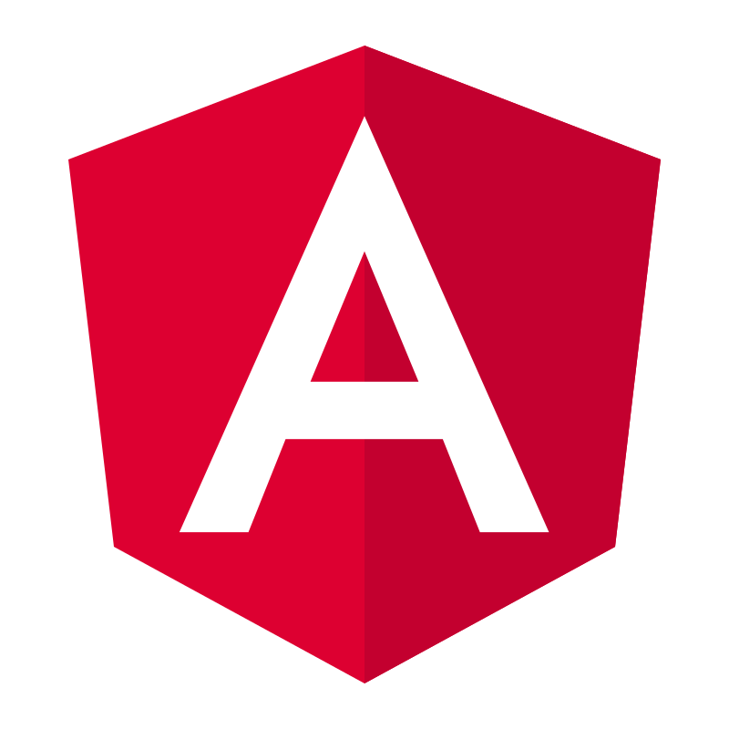
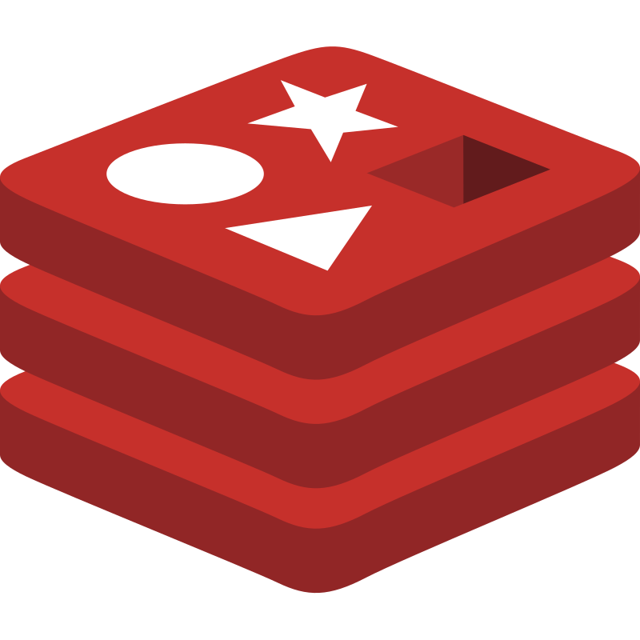

# Hi, I'm Elian

Software Developer | Web Infrastructure & System Performance

---

## Technologies

### Core Languages

|  HTML |  CSS |  JavaScript |  TypeScript |
|---|---|---|---|

### Frontend Frameworks

|  React |  Next.js |  Angular |  Tailwind |
|---|---|---|---|

### Backend Runtime

|  Node.js |  Express |
|---|---|

### Databases

|  SQL |  Redis |  MongoDB |
|---|---|---|

---

## About

Software Developer specializing in web infrastructure and digital services. I build scalable applications with a focus on efficiency and practical implementation. **Linux enthusiast** and **Neovim power user**.

---

## Currently Learning

|  Go |
|---|